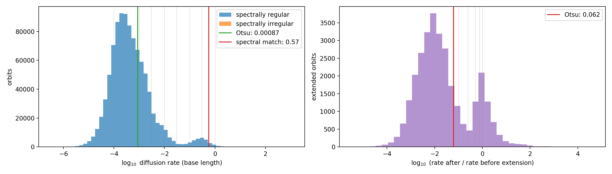

Choosing parameters and checking convergence
=============================================

Three settings decide how trustworthy a classification is: the potential orders
``n_max``/``l_max``, the integration length, and the chaos threshold
``diffusion_threshold``. Each has a helper.

Choosing n_max / l_max
----------------------

``scripts/sweep_truncation.py`` sweeps a grid of ``(n_max, l_max)``, building and
validating the potential at each point (one MPI rank per combination), then
recommends the cheapest orders at the convergence knee. Feed the result to
``run_orbits_mpi.py``:

.. code-block:: bash

   srun --mpi=pmix -n 16 python scripts/sweep_truncation.py --file snap.hdf5
   # -> Recommended: n_max=8 l_max=4   ->  run_orbits_mpi.py --n-max 8 --l-max 4

It prints the full error grid and can save a heatmap with ``--plot sweep.png``.
The recommendation is convergence-relative (cheapest orders within ``--slack`` of
the best grid error), *not* an absolute median-error cut: the median potential
error is monopole-dominated, so an absolute cut would wrongly accept
``l_max = 0``.

From Python, ``Potential.truncation_convergence`` gives the same information as
a ``TruncationSweep`` with a ``.plot()`` method.

Extending drifting orbits (adaptive extension)
----------------------------------------------

A short integration cannot always tell chaos from a slowly converging regular
orbit: both show some frequency drift between the two halves of the run. The
distinction is how the drift behaves as the window grows. A regular orbit's
measured drift is a resolution effect and falls steeply (roughly as the length
ratio to the power -2), whereas a chaotic orbit's does not.

With ``max_extensions > 0``, ``analyse_family`` re-integrates only the orbits
whose diffusion rate exceeds ``diffusion_threshold``, for ``extension_factor``
times longer. An orbit whose rate has not fallen below ``diffusion_drop`` times
its previous value is judged chaotic and is not extended again; one that is still
above the threshold but falling is extended further, up to ``max_extensions``
times. Orbits below the threshold are never re-integrated, so the extra cost is
confined to the drifting orbits:

.. code-block:: python

   res = lf.analyse_family(pot, ps, n_periods=50,
                           max_extensions=2, extension_factor=2.0,
                           diffusion_threshold=0.1, diffusion_drop=0.5)
   res.n_periods_used       # (N,) periods each orbit was integrated for (50/100/200)
   res.diffusion_previous   # (N,) rate before the last extension (NaN if never extended)

   # Use the same values when classifying: an extended orbit is labelled irregular
   # only if its rate is above the threshold AND did not fall by the drop factor.
   cls = res.classify(diffusion_threshold=0.1, diffusion_drop=0.5)

Orbits never extended (all orbits when ``max_extensions=0``) are labelled by the
plain threshold cut. An orbit that is still above the threshold but falling when
the extensions run out keeps its regular label, and a warning reports how many
there are; raise ``max_extensions`` to settle them. Off by default. The run
script exposes it as ``--max-extensions``, ``--extension-factor``,
``--diffusion-threshold`` and ``--diffusion-drop``.

Choosing diffusion_threshold and diffusion_drop
-----------------------------------------------

``classify()`` labels orbits whose frequency-diffusion rate exceeds
``diffusion_threshold`` (default 0.1) as irregular; with extension the same
threshold decides which orbits are re-integrated, and ``diffusion_drop`` (default
0.5) decides whether an extended orbit's drift has fallen enough to be regular.
The right values depend on the integration length and population, so run the
helper on a saved result:

.. code-block:: bash

   python scripts/choose_diffusion_threshold.py orbits.npz --plot threshold.png

It prints the ``log10(rate)`` distribution at the base integration length, and a
table of how many orbits (and how much of each regular family, tubes especially)
each candidate threshold would flag; with extension this is the fraction that
would be re-integrated. It suggests a threshold two ways: the Otsu split of the
log-rate histogram, and the threshold that best agrees with the independent
spectral irregular test (F1). For results with extended orbits it also tabulates
candidate drop factors from the ratio of each orbit's rate after to before
extension, which is usually more clearly bimodal than the raw rate. It warns when
a distribution is not bimodal, in which case no value separates two populations
cleanly and a conservative one is safer.

Example: reading the figure
^^^^^^^^^^^^^^^^^^^^^^^^^^^

``--plot`` saves a figure like the one below, from a run with extension on a
large population (several hundred thousand orbits).

*Left: diffusion rate at the base integration length. Right: the rate after
extension divided by the rate before it, for the extended orbits. Dotted lines
mark the candidate values tabulated by the script; solid lines mark its
suggestions.*

**Left panel (choosing** ``diffusion_threshold`` **).** Almost all orbits sit in
one large peak at ``log10(rate)`` of about -3.7, a rate of order ``2e-4``: these
are the regular orbits, whose drift is only the resolution limit of a finite
window. A second, much smaller bump appears at about -0.5 (a rate of ~0.3),
well separated from the main peak by a shallow valley near -1.5 to -1 (rates of
0.03 to 0.1). The bump is the population that really drifts, so the threshold
belongs in the valley, not inside either peak. Here that is roughly 0.03 to 0.1.
The default of 0.1 sits on the lower flank of the bump and so leaves out its
weakest members; 0.03 catches more of the bump at the cost of a few regular
orbits from the main peak's tail (the per-family table shows how many).

Neither suggestion line is in the valley, and the script's note that they
differ by more than a decade applies:

* The **Otsu** line (green, 0.00087) is inside the main regular peak. With one
  dominant population and a small one, Otsu splits the large peak instead of
  finding the valley between the two, so it is not a usable answer here.
* The **spectral match** line (red, 0.57) lies to the right of the bump. The
  spectrally irregular population is too small to be visible at this scale
  (the orange bars cannot be seen), so the F1 score is driven by very few orbits
  and this value is not reliable either.

When the two suggestions disagree like this, trust the histogram and the
per-family table over the suggestions.

**Right panel (choosing** ``diffusion_drop`` **).** This shows how much each
extended orbit's drift changed when it was re-integrated for longer. It is
clearly bimodal, which is what makes extension useful:

* The large peak at about -2 (the rate fell by a factor of ~100) is orbits whose
  drift was a short-window effect. They settled as the window grew, which is
  what a regular orbit does, so they keep their regular label.
* The smaller peak at about 0 (a ratio of 1) is orbits whose drift did not
  change at all with the longer window. Drift that does not shrink with the
  window is the signature of chaos, so these are labelled irregular.

The valley between the two is at about -0.6 to -0.5 (a ratio of ~0.25 to 0.3),
so any ``diffusion_drop`` in the range 0.25 to 0.5 separates them well; the
default of 0.5 is safe. The red **Otsu** line (0.062) again falls on the
shoulder of the large peak, inside the regular population, so it would call some
falling orbits chaotic and should not be used. The drop factor is well
determined here: the two peaks are far apart and the valley between them is
shallow in comparison.

The caveats on this example: the figure alone does not show the integration
length or the extension factor, which set how far a regular orbit's rate falls
(roughly the length ratio to the power -2), so the position of the large peak on
the right depends on them. Read the peaks and valley off your own histograms, not
the numbers here.
